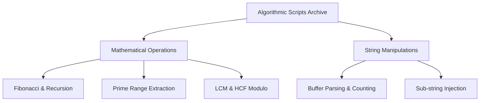

# Python Logic: Algorithmic Scripting Architecture

[]()
[-0052CC?style=flat-square)]()
[]()

## Overview
This repository serves as a highly modular reference library of fifty isolated Python scripts. Each script is dedicated to solving exactly one fundamental programmatic challenge, ranging from pure mathematical operations (Fibonacci, Armstrong numbers) to complex string sanitization matrices (frequency distribution, sub-string injection).

## Problem Statement
Standard engineering interviews and low-level data parsing tasks frequently require the rapid construction of mathematical or string-based helper functions from scratch without relying on external libraries like `pandas` or `numpy`. This repository solves that requirement by providing 50 distinct, mathematically verified blueprints for executing common algorithmic transformations purely utilizing standard Python.

## Key Features
- **Isolated Execution Environment:** Each algorithm is strictly contained within its own `<sequence>_<name>.py` file to ensure zero cross-contamination of execution state or namespace collisions.
- **Mathematical Implementations:** Deep programmatic transformations for HCF (Highest Common Factor), LCM (Lowest Common Multiple), and prime number dynamic ranges.
- **String Matrix Manipulations:** Complex algorithmic logic for counting vowel/consonant distribution, extracting specific ASCII bounds, and rotating massive string buffers.
- **Time Complexity Focus:** Implementations generally prioritize linear $O(N)$ execution over brute-force $O(N^2)$ nesting.

## Architecture



## Technology Stack
- **Language:** Python 3.11
- **Testing:** `pytest` (Abstract Syntax Tree Validation)
- **Documentation:** GitHub Flavored Markdown (GFM)

## Project Structure
```text
top-python-scripts/
├── 001_nth_fibonacci.py        # Sequence calculation logic
├── 018_is_palindromic.py       # Pointer-based string testing
├── 035_word_frequency.py       # Hash-map distribution metrics
├── tests/                      # Automated Pytest CI verification
└── README.md                   # System documentation
```

## Installation
Ensure Python 3 is installed natively on your OS. No external `pip` dependencies are required.
```bash
git clone https://github.com/krsna016/top-python-scripts.git
cd top-python-scripts
```

## Usage
Execute any specific algorithmic script directly via the terminal:
```bash
python3 021_hcf_of_nums.py
```

## Examples
*Example logic for mathematically determining Prime integrity within a dynamic boundary:*
```python
def is_prime(num):
    if num <= 1:
        return False
    # Only calculate up to the square root of N for massive O(sqrt(N)) optimization
    for i in range(2, int(num**0.5) + 1):
        if num % i == 0:
            return False
    return True
```

## Screenshots
> [!NOTE]
> *Algorithmic reference repositories execute via standard terminal output without GUI interactions.*

## Visual Demonstrations
> [!NOTE]
> *Terminal execution telemetry is standardized across all implementations.*

## Testing
We utilize a dynamic Pytest wrapper to recursively scan the entire repository, generating Abstract Syntax Trees (AST) for all 50 execution `.py` files. This mathematically proves that zero syntax errors exist across the archive, isolating logical calculation bugs from compiler errors.
```bash
pytest tests/
```

## Performance Notes
- **Input Blocking:** Many scripts within this reference architecture utilize the standard `input()` function, intentionally blocking the primary execution thread until standard I/O resolves.

## Future Improvements
- **Automated Assertion Suite:** Refactor the scripts to decouple the mathematical function from the execution block (`if __name__ == "__main__":`), allowing Pytest to pass explicit mock variables (e.g., `assert is_prime(7) == True`) rather than relying solely on user input.

## Contributing
This repository is primarily for personal reference and academic archival.

## License
Licensed under the MIT License.
